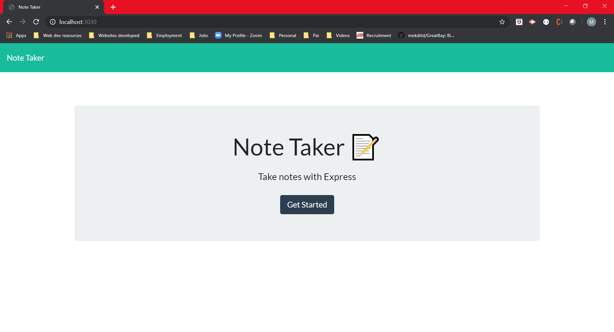
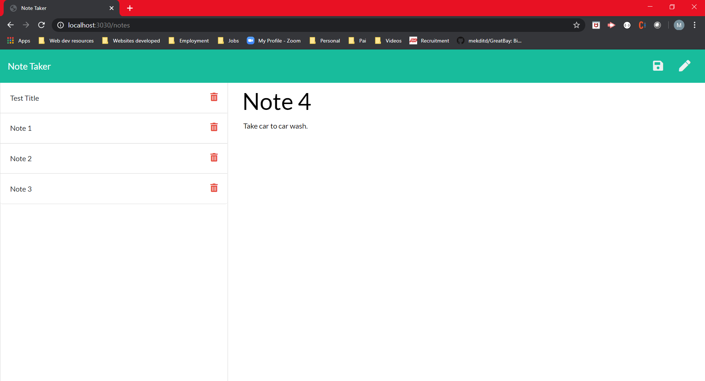
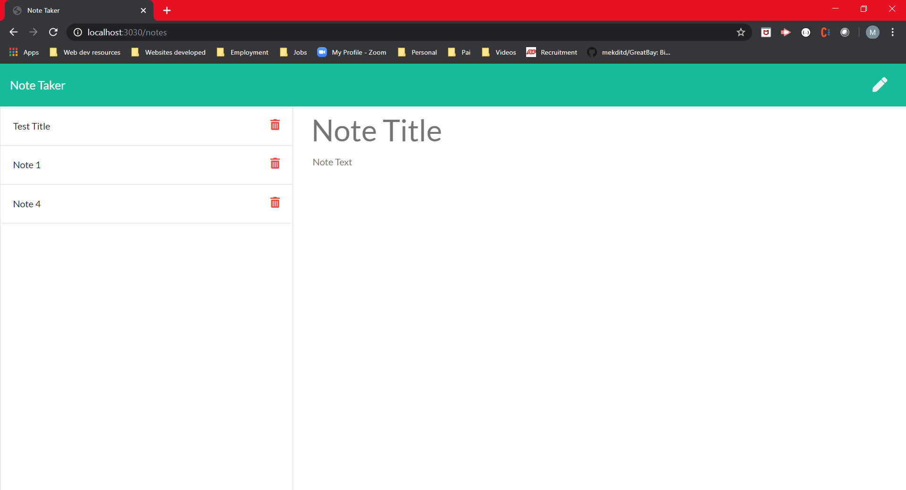

# Note-Taker
You will build a Note Tracker where I can write and save notes, delete notes I have written before, see all notes I have; so I can organize my thoughts and keep track of tasks I need to complete

# Motivation
Generate a webpage where I can apply :Express"

# Prerequisites
The software will run in any Laptop, iPad and phone.

# Results 
* The website should run and be able to save notes and display them on the left side of the screen. If the delilte button is pressed, note should be deleted.

# Screenshots

# Tests 
* add note
* delete note 
* see list of notes
* going to /from pages  

# Author
Maria Dawes-Tedesc0

# Contributing
Please read [CONTRIBUTING.md](https://gist.github.com/PurpleBooth/b24679402957c63ec426) for details on our code of conduct, and the process for submitting pull requests to us.

# Versioning
For the versions available, see https://github.com/MariaDawes/Template-Engine/commits/master

# Acknowledgement
Thank you for Bhavana's collaboration.

